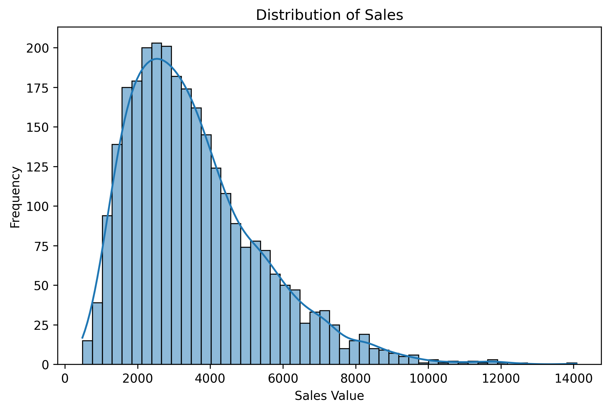
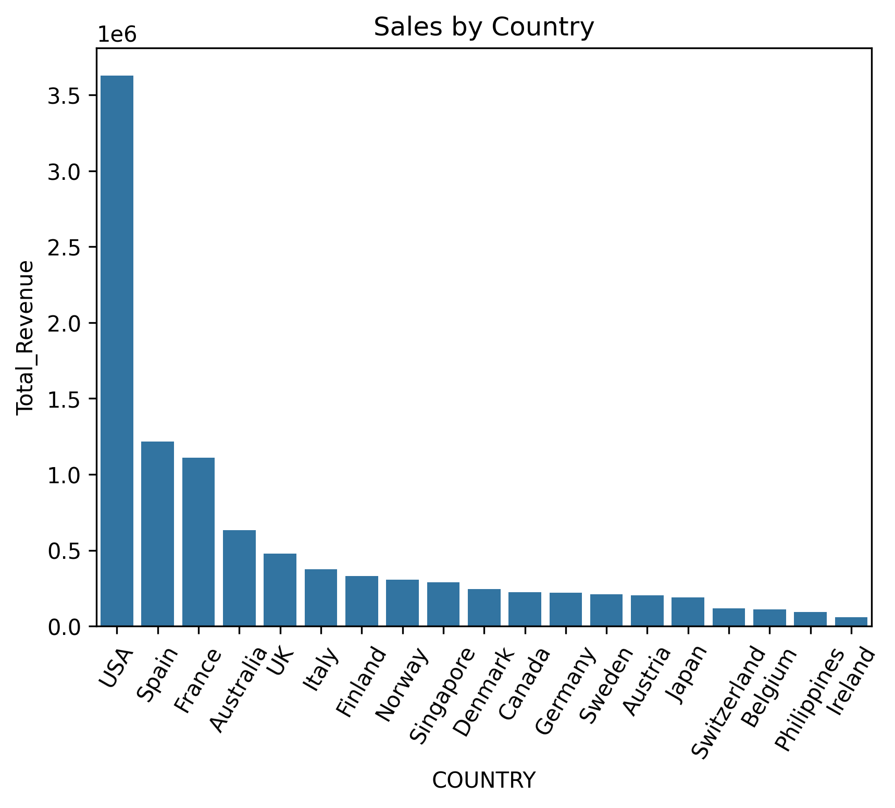
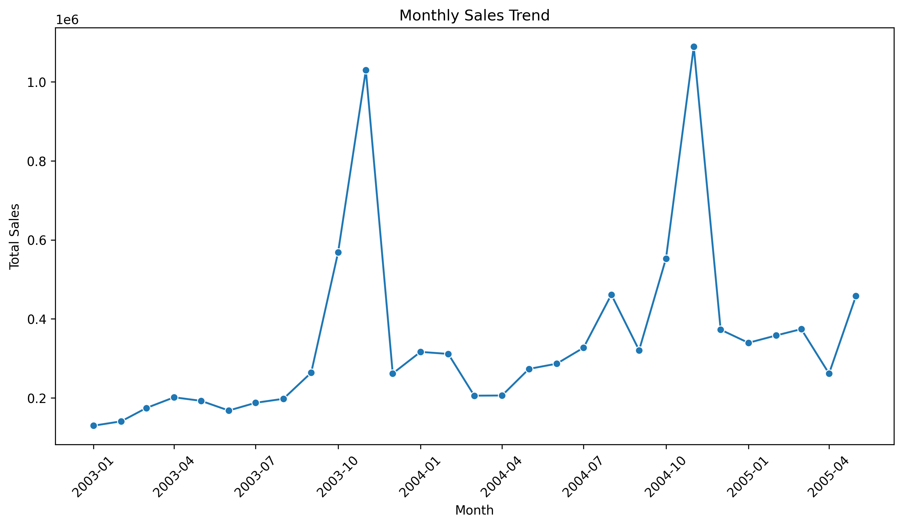

# 🛒 E-commerce Sales Analysis

This project explores an e-commerce dataset to uncover trends in sales, revenue, and customer behavior.  
It focuses on data cleaning, exploratory data analysis (EDA), and visualization.

---

## 📊 Objectives

- Identify top-performing regions
- Explore monthly and seasonal sales trends
- Provide actionable business insights with clear visualizations

---

## 🔑 Key Findings

- **Seasonal Peaks**: Sales consistently peak in November, indicating the importance of holiday-season marketing.
- **Geographic Insights**: USA, Spain, and France are generating the highest revenue.

---

## 🖼️ Key Visualizations



_The chart above shows a distribution with right-skewed._



_The chart above provides a clear view of the countries contributing the most to total revenue._



_The chart above shows a clear seasonal pattern with sales peaking in November._

---

## 🗂️ Project Structure

📂 ecommerce-sales-analysis
├── data/ # dataset
├── notebooks/ # Jupyter Notebook(s)
├── images/ # plots saved as PNGs
├── requirements.txt # list of Python libraries
└── README.md # project documentation

---

## 📂 Dataset

- Source: [Kaggle Sample Sales Data](https://www.kaggle.com/datasets/kyanyoga/sample-sales-data)

---

## ⚙️ Installation

Clone repo and install dependencies:

```bash
git clone https://github.com/DimaKlimchuk/ecommerce-sales-analysis.git
cd ecommerce-sales-analysis
pip install -r requirements.txt
```
